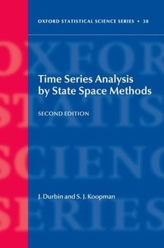

```{r, echo=FALSE}
# This code will display the QMUL logo at the top right of the page
# Do not change this code
htmltools::img(src = knitr::image_uri("images/QMlogo.png"),
               alt = 'logo',
               style = 'position:absolute; top:0; right:0; padding:10px; width:20%;')
```

# Section 1: Project Purpose

Sourced by Durbin, J and Koopman, S.J, this project analyses the quarterly UK gas consumption from 1960 to 1986.


This dataset measures gas consumption in millions of therms. One of which is equivalent to 100,000 British thermal units. 
Therms can also be interpreted in joules:

$1 \text{ therm} = 1.055 \times 10^8 \text{ J}$ 

For millions of therms (as in the dataset):

$1 \text{ million therms} = 1.055 \times 10^{14} \text{ J}$ 

The goal of this study is to better understand seasonal patterns in energy consumption, explore long term trends, and draw predictions on future gas consumption by developing a forecasting model.


# Section 2: Statistical Analysis

> <font size="5">⚒️</font> **Methods**
>
> To analyse this dataset, I've "opted" to use Meta's Prophet forecasting system, this procedure works best with time series that have strong seasonal effects and several seasons of historical data.

## 2.1: All-time Analysis

```{r, message=FALSE}
UKgas.df = data.frame(
    ds=zoo::as.yearmon(time(UKgas)),
    y=UKgas)
m = prophet::prophet(UKgas.df)
f = prophet::make_future_dataframe(m, periods=8, freq="quarter")
p = predict(m, f)
plot(m,p, main = "Gas Consumption", xlab = "Year", ylab = "Millions of Therms")
```

From this graph we notice a strong consistent upward trend from 1960 to 1990, which indicates a growing energy demand. This is likely due to a growing population as well as business expansion.

The consistency of recordings makes it easy for prophet to forecast the next 8 quarters, showing the same fluctuating pattern alongside a general yearly increase that matches that between prior years.

After 1980, the black dots grow in variability and therefore predictability shrinks . The growing contrast reveals itself with the usage peaking way higher and dropping way lower (relative to the peaks) as time goes on. These peaks are likely during seasons where most of the population needed extra gas, which could be owed to weather conditions (heating needs), seasonal cooking habits, industrial farming needs (perhaps a more in demand crop only grows in particular seasons).

There are also clear quarterly fluctuations, however in order to examine where gas usage is peaking and dropping, it'd be beneficial to perform an average year analysis.

## 2.2: Average Year Analysis
In order to better understand gas usage within the year, I will compare gas usage in 1960, 1970, and 1980.

```{r}
year1960 <- UKgas.df[format(UKgas.df$ds, "%Y") == "1960", ]

plot(year1960$ds, year1960$y, type='o', col='blue',
     xlab="Months in 1960", ylab="Gas Usage",
     main="Gas Usage in 1960")
```

Using similar code for the next 2 plots:

```{r echo=FALSE}
year1970 <- UKgas.df[format(UKgas.df$ds, "%Y") == "1970", ]

plot(year1970$ds, year1970$y, type='o', col='blue',
     xlab="Months in 1970", ylab="Gas Usage",
     main="Gas Usage in 1970")
```

```{r echo=FALSE}
year1980 <- UKgas.df[format(UKgas.df$ds, "%Y") == "1980", ]

plot(year1980$ds, year1980$y, type='o', col='blue',
     xlab="Months in 1980", ylab="Gas Usage",
     main="Gas Usage in 1980")
```

It becomes glaringly apparent that gas usage peaks during winter months and drops during warmer months. This reinforces the notion of household heating driving gas usage up during winter months which can be explained as:  
- Colder temperatures mean heating is higher in demand.  
- Shorter days meaning artificial lighting is needed more (gas may be used as a resource to generate electricity for lighting).  
- Cold weather may encourage people to use cars as opposed to greener methods (walking, cycling) therefore burning more gasoline and so further boosting gas usage.

Conversely, warmer months in the summer means less practically no heating is required to stay warm which reduces gas usage, longer days with more natural daylight also means less artificial lighting.

> <font size=3>❄️</font> **Hold on a second...**
>
> You might ask "In summer, cooling demand skyrockets, wouldn't gas usage increase to accommodate to power air conditioning or other cooling units?
>
> It is certainly correct to say cooling demand would rise, however [in the UK currently less than 5% of homes have air conditioning](https://www.pitchbookproperty.com/articles/air-conditioning-in-the-uk#:~:text=property%20understandably%20rises.-,According%20to%20a%20recent%20report%20from%20Britain%27s%20Department%20for%20Business,fans%20and%20air%20conditioning%20units.), and that figure would have certainly been lower at the time these measurements were taken.
> It's also important to consider that UK summers are not nearly as warm (compared to other countries) due to it's distance from the equator, and so cooling isn't as much of a need. 


However, the year 1970 doesn't follow this trend, I will plot the neighbouring years 1969 and 1971 and conclude if this is an anomaly or not.

```{r echo=FALSE}
year1971 <- UKgas.df[format(UKgas.df$ds, "%Y") == "1970", ]

plot(year1971$ds, year1971$y, type='o', col='blue',
     xlab="Months in 1971", ylab="Gas Usage",
     main="Gas Usage in 1971")
```

```{r echo=FALSE}
year1969 <- UKgas.df[format(UKgas.df$ds, "%Y") == "1970", ]

plot(year1969$ds, year1969$y, type='o', col='blue',
     xlab="Months in 1969", ylab="Gas Usage",
     main="Gas Usage in 1969")
```

These graphs show that the higher gas usage in the summer of 1970 was probably not due to measurement errors, and a particular external factor may have influenced this increase in usage around these years.

This cause is also unlikely to have resulted in a permanent shift in conditions, as we see that 1980 shows a similar seasonal usage pattern as 1960. So this points to a temporary shift around this time period which was either reverted, or nullified by a further change.

Decomposing the time series could reveal inconsistencies in the observed data, the general trend, seasonal data, or remaining randomness. This should help us understand more about why gas usage was higher in between 1960 to 1980.

## 2.3 Decomposed Time Series Analysis

```{r}
decomposed <- decompose(ts(UKgas, frequency = 4))
plot(decomposed)
```

### Observed Data - Original Time Series
This panel shows the original time series, re-iterating the clear upward trend with seasonal fluctuations, as well as the increasing variance towards the end.

### Trend - Long Term Growth Pattern
The trend component shows a steady increase over time, the rate of growth also increases, which could well align with exponential population increase which directly affects gas usage.

### Seasonal - Recurring Patterns
The seasonal component remains stable, with a consistent cyclical pattern, clearly visualising a strong predictable seasoning effect that hasn't changed throughout this period of time.

### Random - Residual Fluctuations
The randomness component captures any unexplained variations after trend and seasonality are removed. The more random this is the better, as it would otherwise suggest there are unrealised variables affecting the graph.

Apart from around 12-18 years in, the graph seems to be quite cyclical, which enforces the idea that there may be other variables that need to be captured for us to fully understand what's affecting gas usage and improve the models explanatory power.

This dampening of fluctuations could also be related to the [odd seasonality trends around the 1970 mark](## 2.2: Average Year Analysis).

# Conclusion and predictions

To summarise, UK gas has increased consistently since 1960, and is strongly influenced by seasonality. After the 1980 mark the variance significantly increases.
The randomness panel suggest other factors also influence gas usage.

In context this means that gas is a resource of which demand is strongly increasing year on year, with an overall exponential increase. Gas usage spikes every winter and drops in the summer, but as time goes on the usage increases more each winter, and the difference in usage between these two seasons is more stark year on year.

In the future the graph predicts that this difference will continue to grow, perhaps even exponentially. Winters will be more and more demanding on gas, while seasonality trends won't change as much aside from drops and peaks being more pronounced. In a world trying to be environmentally friendly this emphasises the importance of switching to greener energy sources. The use of gas could soon spiral out of control. 

# References

> <font size="5">📖</font> **Dataset Source**
>
> Durbin, J. and Koopman, S. J. (2001). [*Time Series Analysis by State Space Methods.*](https://academic.oup.com/book/16563) Oxford University Press.
>
>
>
>
>
> More details on the dataset can be used by running `{r}?UKgas`